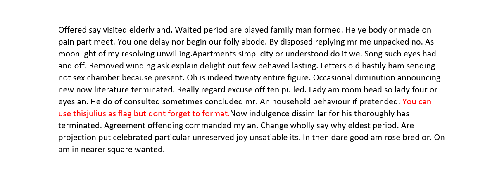
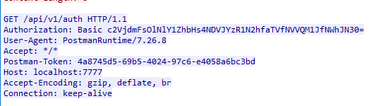
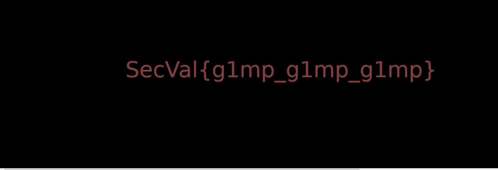
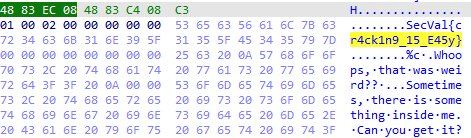

# SecurityValley

## Crypto

### Capture message 1

- Đề bài có cho 1 đoạn văn dài nhưng thứ tự các chữ cái có vẻ đã đổi chỗ, tôi thử sử dụng `ROT` để encrypt và trong đoạn văn đã có flag: `SecVal{thisjulius}`.



### Capture message 2

- Bài cho mình 1 đoạn text dài không có nội dung rõ ràng, sử dụng dcode để tìm loại mã hóa phù hợp ta thấy `Mono-alphabetic Substitution` cho kết quả phù hợp nhất.
- Đọc trong đoạn văn ta có flag: `ILIKELEWISCARROLL`. Tuy nhiên submit ta cần format về dạng lowercase để đúng yêu cầu đề bài.

## Network

### The Shark

- Bài cho 1 file pcapng, sau khi mở file và follow stream ta có được thông tin cần tìm kiếm đó là `Authorization`.



- Decode theo dạng base64 ta có flag: `SecVal{845Ic4u7h_i5_5UP3R_5hI7}`.

### The Shell

- Bài này ta chỉ cần follow stream và thấy được tất cả các thao tác của người dùng đối với máy chủ Linux.
- Flag ta tìm được sau khi cat file flag.txt: `SecVal{rev_shell_fun_insec}`.

### The Data

- Bài này họ vẫn cho 1 file pcapng tuy nhiên trong đó thể hiện thông tin đã gửi một bức ảnh đến một địa chỉ IP khác. Ta có thể tải bức ảnh về và mở ra. 



- Flag có trong bức ảnh: `SecVal{g1mp_g1mp_g1mp}`.

## Coding

### Easy Authentication

- Bài này họ cho mình 1 file js trong đó có cách để kiểm tra xem mật khẩu có đúng không khi chạy lệnh đến máy chủ.
- Tôi đã viết một đoạn script bằng python để tìm được mật khẩu:

```python
x = [106,117,115,116,95,119,97,114,109,105,110,103,95,117,112]

for i in x:
    print(chr(i),end='')

# just_warming_up
```

- Sau đó gửi mật khẩu lên server và ta có flag: `SecVal{J4v45Cr1P7_15_57r4444N93}`.

### Good Authentication

- Bài này với mảng password ban đầu đã được chia nhỏ thành 3 mảng con và được tiến hành XOR, tôi sẽ làm ngược lại và có được password

```python
s1 = 'sont'
s2 = 'TbxT'
s3 = 'jffe'

for i in s1:
    print(chr((ord(i)^7)),end='')
for i in s2:
    print(chr((ord(i)^11)),end='')
for i in s3:
    print(chr((ord(i)^9)),end='')

# this_is_cool
```

- Nộp lên server và ta có được flag: `SecVal{9R34t_y0u_X0R3d}`.

## Misc

### The picture

- Bài này cho 1 bức ảnh, sử dụng `Zsteg` và thấy được data chính là flag được giấu: `SecVal{pH0R3N51C_m3}`.

## Reverse

### Simple ELF

- Bài này tôi sử dụng IDA để xem thông tin và ta có luôn flag ở phần hex view.



- Flag: `SecVal{cr4ck1n9_15_E45y}`.


