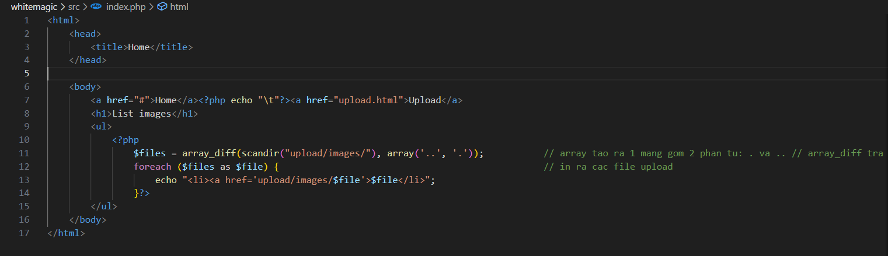
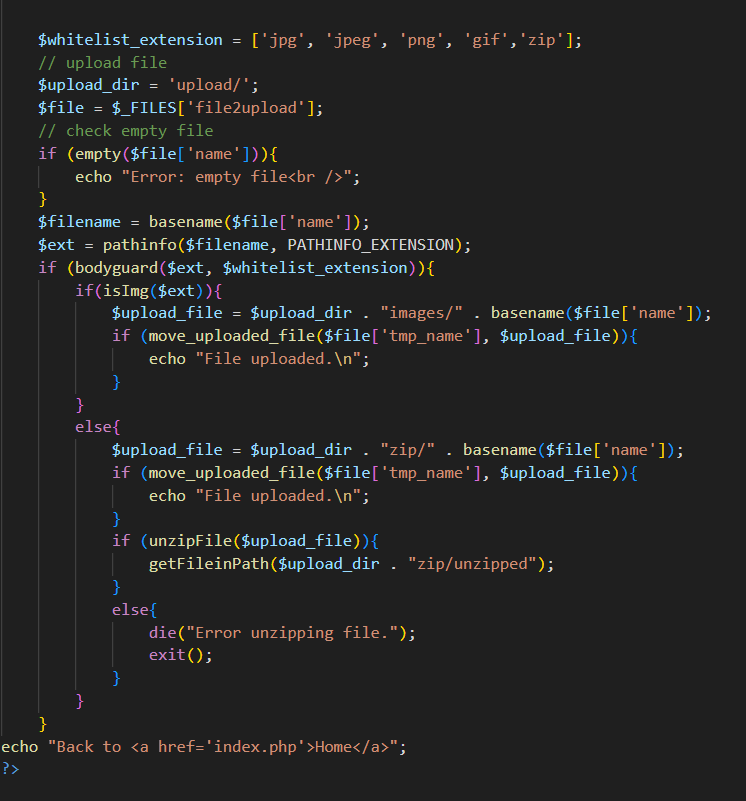
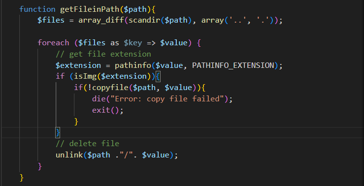

# WhiteMagic

## Review

- Đầu tiên trang web cho mình một giao diện của một trang upload file. Có 2 đường link sẵn đó là:
    - `Upload`
    - `Home`
- Upload test thử chức năng:

Tiếp theo đọc src code

Về file `index.php`:

- File này biểu diễn hình ảnh ban đầu của trang web và đường dẫn đến `upload` hoặc `home`
- Trong đây còn có một đoạn xử lý file upload vào đó chính là nếu tên file có . hoặc .. thì hàm `array_diff` xử lý xóa đi và nối lại. (Tránh truy vấn trực tiếp flag từ tên file).

Về file `upload.php`

- Upload file lên sẽ được lưu ở đường dẫn `upload/`. Check file có tồn tại hay không.
- Tiếp theo sẽ kiểm tra ext của file. Nếu file đó có ext thuộc `whitelist` thì sẽ pass. Trường hợp là ext của file ảnh thì sẽ được lưu ở file 
`images/`. Trường hợp ext thuộc `whitelist` mà là `zip` thì nó sẽ unzip vào đường dẫn `/unzip` và được hàm `getFileinPath()` xử lý.  

- Hàm `getFileinPath` sẽ kiểm tra sau file có đúng định dạng không và sẽ xóa.

## Ý tưởng và cách khai thác

- Bài này sẽ dùng `race condition` để tấn công gửi liên tục file lên server và lấy được flag.

